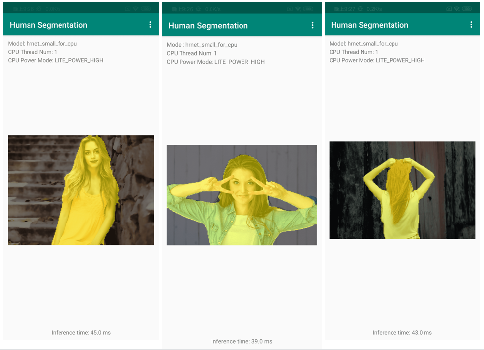

简体中文 | [English](lite.md)

# 移动端Lite部署

## 1.介绍

飞桨针对不同场景，提供了多个预测引擎部署模型（如下图），更多详细信息请参考[文档](https://paddleinference.paddlepaddle.org.cn/product_introduction/summary.html)。


本文以人像分割在安卓端的部署为例，介绍如何使用[Paddle-Lite](https://github.com/PaddlePaddle/Paddle-Lite)对分割模型进行移动端的部署。文档第2章介绍如何使用人像分割安卓端的demo，第3章介绍如何进行二次开发，更新Paddle-Lite预测库，或将新的PaddleSeg模型部署到安卓设备。

## 2.安卓Demo使用

### 2.1 要求
* Android Studio 3.4；
* Android手机；

### 2.2 一键安装
* git clone https://github.com/PaddlePaddle/PaddleSeg.git ;
* 打开Android Studio，在"Welcome to Android Studio"窗口点击"Open an existing Android Studio project"，在弹出的路径选择窗口中进入"PaddleSeg/deploy/lite/humanseg_android_demo/"目录，然后点击右下角的"Open"按钮即可导入工程，构建工程的过程中会自动下载demo需要的模型和Lite预测库；
* 通过USB连接Android手机；
* 载入工程后，点击菜单栏的Run->Run 'App'按钮，在弹出的"Select Deployment Target"窗口选择已经连接的Android设备，然后点击"OK"按钮；

*注：此安卓demo基于[Paddle-Lite-Demo](https://github.com/PaddlePaddle/Paddle-Lite-Demo)开发，更多的细节请参考该repo。*

### 2.3 预测
* 在人像分割Demo中，默认会载入一张人像图像，并会在图像下方给出CPU的预测结果和预测时延；
* 在人像分割Demo中，你还可以通过上方的"Gallery"和"Take Photo"按钮从相册或相机中加载测试图像；

*注意：demo中拍照时照片会自动压缩，想测试拍照原图效果，可使用手机相机拍照后从相册中打开进行预测。*

### 2.4 效果展示


## 3.二次开发
您可按需要更新预测库或模型进行二次开发，其中更新模型分为模型导出和模型转换两个步骤。

### 3.1 更新预测库
Paddle-Lite的编译目前支持Docker，Linux和Mac OS开发环境，建议使用Docker开发环境，以免存在各种依赖问题，同时也提供了预编译版本的预测库。准备Paddle-Lite在安卓端的预测库，主要包括三个文件：

* PaddlePredictor.jar；
* arm64-v8a/libpaddle_lite_jni.so；
* armeabi-v7a/libpaddle_lite_jni.so；

下面分别介绍两种方法：

* 使用预编译版本的预测库，最新的预编译文件参考：[release](https://github.com/PaddlePaddle/Paddle-Lite/releases/)，此demo使用的[版本](https://paddlelite-demo.bj.bcebos.com/libs/android/paddle_lite_libs_v2_8_0.tar.gz)

    解压上面文件，PaddlePredictor.jar位于：java/PaddlePredictor.jar；

    arm64-v8a相关so位于：java/libs/arm64-v8a；

    armeabi-v7a相关so位于：java/libs/armeabi-v7a；

* 手动编译Paddle-Lite预测库
开发环境的准备和编译方法参考：[Paddle-Lite源码编译](https://paddle-lite.readthedocs.io/zh/release-v2.8/source_compile/compile_env.html)。

准备好上述文件，即可参考[java_api](https://paddle-lite.readthedocs.io/zh/release-v2.8/api_reference/java_api_doc.html)在安卓端进行推理。具体使用预测库的方法可参考[Paddle-Lite-Demo](https://github.com/PaddlePaddle/Paddle-Lite-Demo)中更新预测库部分的文档。

### 3.2 模型导出
此demo的人像分割模型为基于HRNet w18 small v1的humanseg模型（[下载链接](https://bj.bcebos.com/paddleseg/deploy/lite/android/hrnet_w18_small.tar.gz)），更多的分割模型导出可参考：**模型导出**

### 3.3 模型转换

#### 3.3.1 模型转换工具
准备好PaddleSeg导出来的模型和参数文件后，需要使用Paddle-Lite提供的opt对模型进行优化，并转换成Paddle-Lite支持的文件格式，这里有两种方式来实现：

详细的模型转换方法参考paddlelite提供的官方文档：[模型转化方法](https://paddle-lite.readthedocs.io/zh/release-v2.8/user_guides/opt/opt_python.html)，从PaddleSeg里面导出来的模型使用opt即可导出以`.nb`名称结尾的单个文件。

* 使用预编译版本的opt，最新的预编译文件参考[release](https://github.com/PaddlePaddle/Paddle-Lite/releases/)，此demo使用的版本为[V2.8](https://paddle-lite.readthedocs.io/zh/release-v2.8/quick_start/release_lib.html#opt) ；

* 手动编译opt

(1)参照 [编译安装](https://paddle-lite.readthedocs.io/zh/release-v2.8/source_compile/compile_env.html) 进行环境配置和编译

(2)进入docker中PaddleLite根目录，git checkout [release-version-tag]切换到release分支。此demo使用的版本为V2.8

(3)执行如下命令编译opt
```
./lite/tools/build.sh build_optimize_tool
```
(4)编译完成，优化工具在`Paddle-Lite/build.opt/lite/api/opt`

#### 3.3.2 更新模型
将优化好的`.nb`文件，替换app/src/main/assets/image_segmentation/
models/hrnet_small_for_cpu下面的文件即可。


## 常见问题
Q: 构建Android工程时提示权限不足
```
/Users/xxx/human_segmentation_demo/app/cache/71j4bd3k08cpahbhs9f81a9gj9/cxx/libs/arm64-v8a/libhiai_ir_build.so (Permission denied)
```
A: 开放缓存权限
```
chmod -R 777 /Users/xxx/human_segmentation_demo/app/cache/
```
